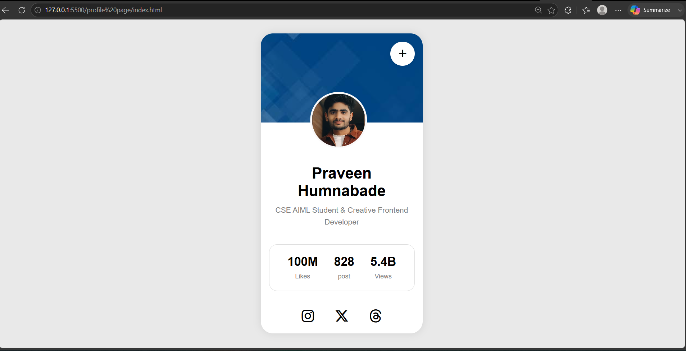

# Profile Card Website

A modern and responsive profile card webpage created using HTML and CSS.  
This project showcases a personal profile card with social media icons, profile image, and statistics section.

## Features

- Responsive profile card design
- Modern UI layout
- Circular profile image
- Social media icons
- Statistics section
- Clean and beginner-friendly code

## Technologies Used

- HTML5
- CSS3
- Font Awesome Icons

## Screenshot

## Sections Included

### Profile Information
- Name
- Profession
- Profile photo

### Statistics
- Likes
- Posts
- Views

### Social Media Icons
- Instagram
- X (Twitter)
- Threads

## Folder Structure
